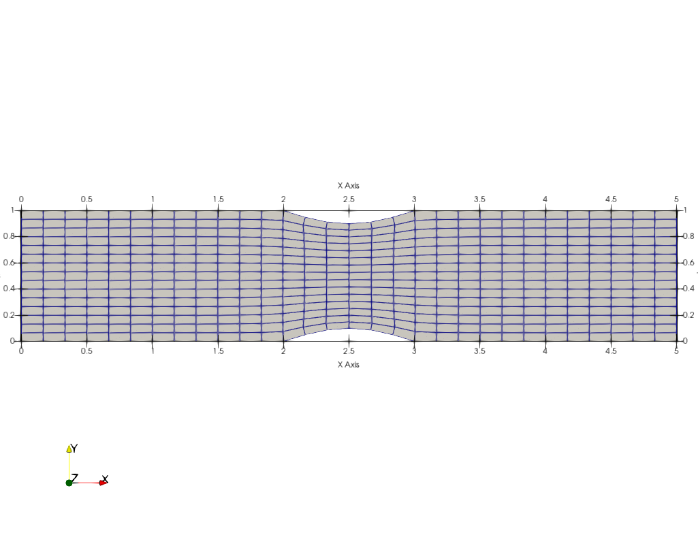
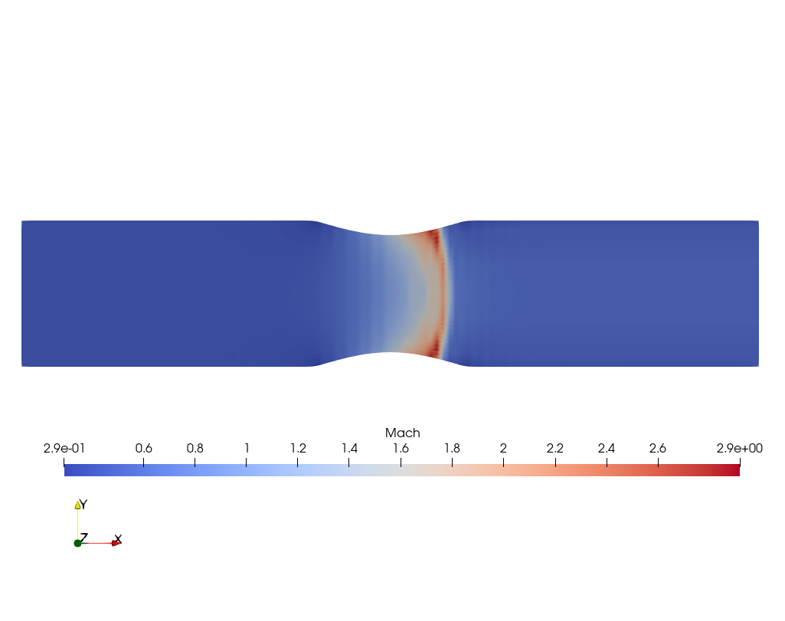

## Repo for AERO615 projects

Project1: development of a Laplace grid generator

## Double bump grid

Project2: development of an Euler solver using the Jameson-Schmidt-Turkel scheme for the artificial viscosity

## Inlet Mach number = 0.7

